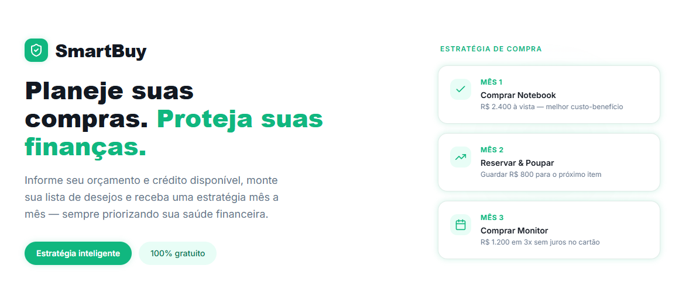

# SmartBuy 🛒💡
   


Planejamento inteligente de compras com foco na sua saúde financeira

O SmartBuy é um sistema que transforma a maneira como você planeja suas compras. Em vez de apenas listar itens, ele cria uma estratégia financeira personalizada baseada no seu orçamento mensal e limite de crédito.

## Tecnologias

As seguintes tecnologias foram utilizadas na construção do projeto:

### Front-End
- React
- JavaScript

### Back-End
- Python 3.12
- Flask (API Rest)
- Pytest (Suíte de testes de unidade e integração)


## Pré-requisitos
- Python 3.12+
- Node.js (v18+)
- Pip (Gerenciador de pacotes Python)

## Instalação

Clone o repositório:

```shell
git clone https://github.com/sakurahoney98/smart-buy.git
```


## Execução

### Backend
1. Acesse a pasta do projeto
``` shell
cd backend
``` 

2. Crie e ative um ambiente virtual
``` shell
python -m venv venv
source venv/bin/activate
```

3. Instale as dependências
``` shell
pip install -r requirements.txt
```

4. Execute a API
``` shell
python -m src.app.entrypoints.main
```

### Frontend
1. Acesse a pasta do projeto
``` shell
cd frontend
``` 

2. Instale as dependências
``` shell
npm install
```

4. Execute
``` shell
npm run dev
```

**Acesse o sistema via navegador:**  
[http://localhost:5173/](http://localhost:5173)


## Testes

O projeto utiliza o Pytest e Vitest para garantir a integridade das regras de negócio.

### Backend
1. Acesse a pasta do projeto

``` shell
cd backend
```

2. Rode o comando

```shell
pytest
```

ou

``` shell
python -m pytest -v
```

### Frontend
1. Acesse a pasta do projeto

``` shell
cd frontend
```

2. Rode o comando

```shell
npm test
```

ou

``` shell
npm run test:ui
```


## Contribuindo

Contribuições são sempre bem-vindas!

Veja o  [manual de contribuição](CONTRIBUTING.md) para saber como começar.


## Conecte-se comigo
[](mailto:caroline.santana@ucsal.edu.br) [](https://www.linkedin.com/in/caroline-santana-36378215a/)
